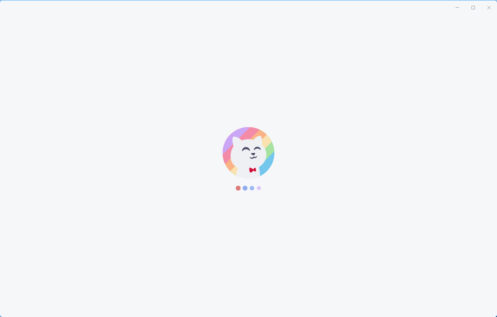
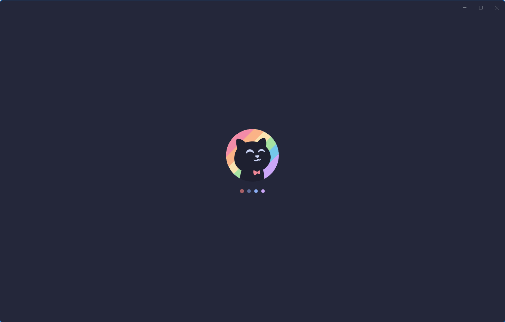
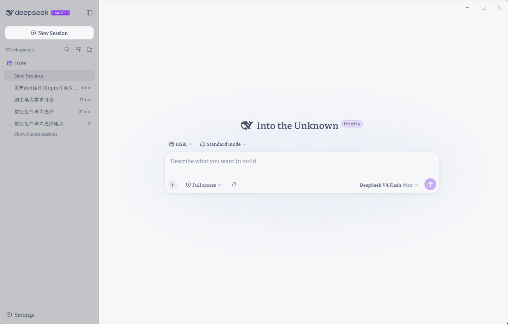
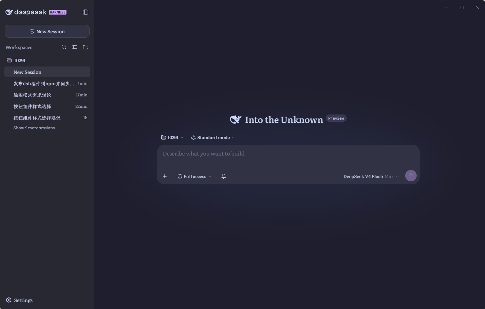
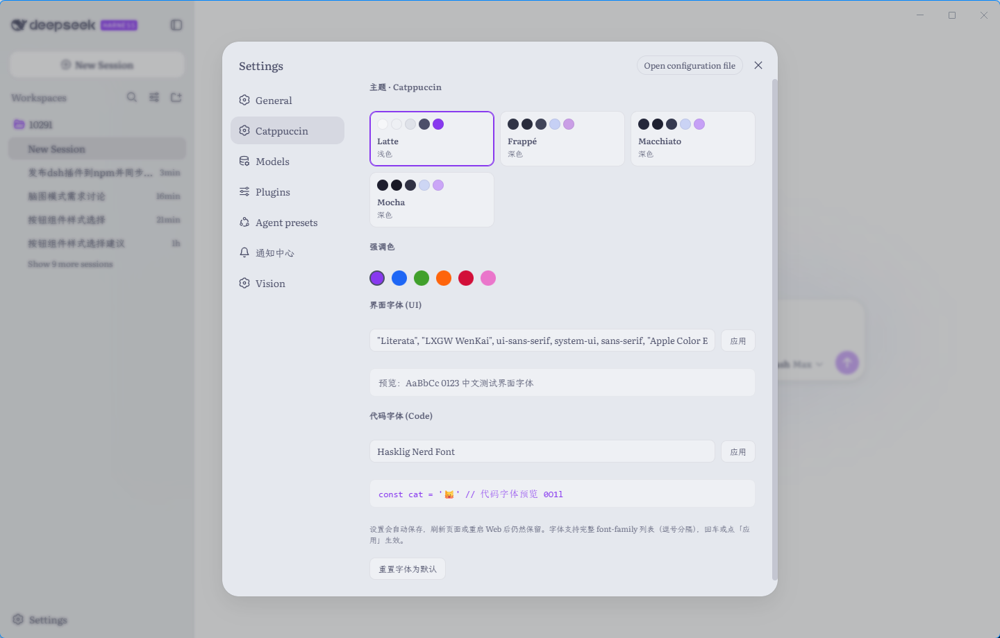

# 🐱 dsh-catppuccin-x

> DeepSeek Harness WebUI 个性化插件 —— Catppuccin 全 flavor 主题、强调色、自定义字体与品牌化首屏加载页。

基于 [Catppuccin](https://catppuccin.com/) 官方调色板，为 DeepSeek Harness Web 界面提供完整的个性化能力：四套 flavor 主题一键切换、六种强调色叠加、UI / 代码字体自定义，以及跟随所选 flavor 变色的启动加载页。设置通过 Host 设置文档持久化，重启后自动恢复，全程无需修改官方源码。

## ✨ 功能特性

- **四套 Catppuccin flavor 主题**：Latte（浅色）/ Frappé / Macchiato / Mocha（深色），完整映射 DSW 主题 token（`--dsw-*` alias 全量覆盖）
- **六种强调色**：淡紫 / 蓝 / 绿 / 蜜桃 / 红 / 粉，基于 `theme.overrideTokens` 叠加层实现，可叠加在任意活动主题之上
- **自定义字体**：界面字体（UI）与代码字体（Code）分别填写 font-family 列表，覆盖 `:root` 字体变量，带实时预览
- **品牌字标跟随强调色**：顶部 "harness" 品牌徽章自动采用当前强调色，深色 flavor 下依然清晰可读
- **品牌化首屏加载页**：内联 Catppuccin logo + 四个呼吸点，随已保存的 flavor 自动变色，logo 缺失时安全降级为默认加载页
- **设置面板「Catppuccin」**：在 Web 设置页注册专属分区，设置经 Typert RPC 持久化到 Host 设置文档，刷新 / 重启自动恢复
- **兼容内置同名主题**：与 DSH 内置 Catppuccin 主题共存时自动跳过重复注册，不冲突

## 📸 截图

**启动加载页（Boot Splash）**

| Latte（浅色） | Mocha（深色） |
| --- | --- |
|  |  |

**主界面（Main Workspace）**

| Latte（浅色） | Mocha（深色） |
| --- | --- |
|  |  |

**设置面板（Settings → Catppuccin）**



## 📦 安装

> 需要 DeepSeek Harness 环境，且插件通过 profile（默认 `web`）的 pnpm 依赖树加载。

**方式一：通过 `dsh plugin` 命令**

```bash
# 从 npm 安装（发布后）
dsh plugin --profile web add dsh-catppuccin-x

# 或直接从 GitHub 安装（未发布时）
dsh plugin --profile web add github:shineK9/dsh-catppuccin-x
```

**方式二：手动 pnpm**

```bash
cd ~/.dsh/profiles/web
pnpm add dsh-catppuccin-x
```

安装完成后重启 DSH（或刷新 Web 页面），在 **设置 → Catppuccin** 中进行个性化配置。

## 🎨 使用

打开 Web 设置页，左侧选择 **Catppuccin** 分区：

1. **主题**：点击 Latte / Frappé / Macchiato / Mocha 卡片切换 flavor（同步改变启动页配色）
2. **强调色**：点击色点选择强调色，品牌主色、按钮、选中态等同步变化
3. **字体**：在「界面字体 (UI)」「代码字体 (Code)」输入框中填写 font-family 列表（逗号分隔），回车或点击「应用」生效，可随时「重置字体为默认」

所有设置自动保存，刷新页面或重启 Web 后仍然保留。

**推荐字体**（可直接复制到设置页输入框）：

- 界面字体 (UI)：

  ```
  "Literata", "LXGW WenKai", ui-sans-serif, system-ui, sans-serif, "Apple Color Emoji", "Segoe UI Emoji", "Segoe UI Symbol", "Noto Color Emoji"
  ```

- 代码字体 (Code)：

  ```
  Hasklig Nerd Font
  ```

## 🛠 开发

```
├── lib/
│   ├── index.js          # 宿主半：设置命名空间注册 + catppuccinTheme 服务 + splash 注入
│   ├── client.js         # 浏览器端：flavor 注册 / 强调色叠加 / 字体覆盖 / 设置面板
│   ├── splash.js         # 首屏加载页纯函数模块（可独立测试）
│   └── typert.host.js    # Typert RPC 清单（与客户端 remote 调用一一对应）
├── test/
│   └── splash.test.js    # splash 模块回归测试
├── cordis.patch.yml      # profile 层插入声明（bundle patch）
├── logo.svg              # 启动页 Catppuccin logo
└── assests/              # 截图素材
```

运行测试：

```bash
node --test test/splash.test.js
```

## 📄 许可

[MIT](LICENSE)
